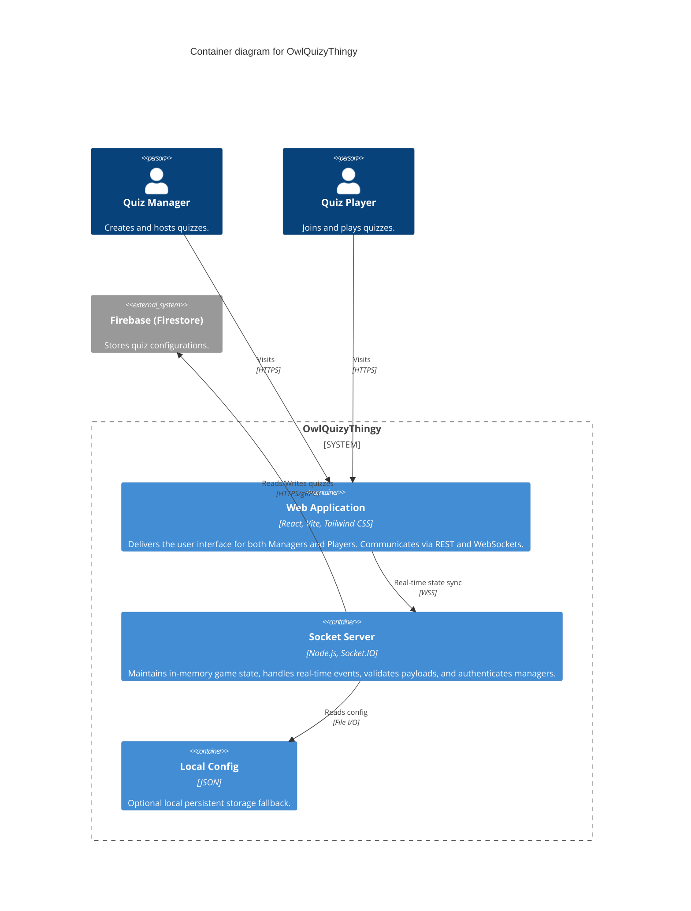

# Container Architecture

## Overview

The **Container Architecture** document breaks down OwlQuizyThingy into its independently executable subsystems and shows how they communicate.

## Container Diagram

## Containers

1. **Web Application (`@rahoot/web`)**:
   - A single-page application (SPA) built in React 19.
   - Hosted statically or via a lightweight Nginx container.
   - Manages client-side state using Zustand and interacts with the backend strictly through Socket.IO.

2. **Socket Server (`@rahoot/socket`)**:
   - The authoritative backend running on Node.js.
   - Uses Socket.IO for duplex communication.
   - Enforces business logic and state machine transitions entirely in-memory.

3. **Local Config**:
   - For environments lacking Firebase, a local JSON file stores minimal quiz definitions.
