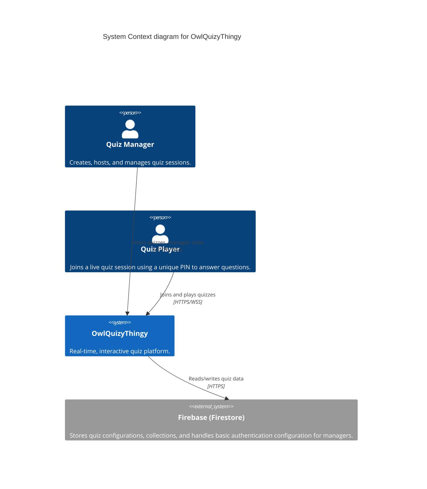

# System Context

## Overview

The **System Context** document defines the high-level boundaries, users, and external systems that interact with **OwlQuizyThingy**.

## Context Diagram

## System Elements

- **Quiz Manager**: The primary user who authenticates into the system, creates the quiz logic, opens a session, and navigates players through the questions.
- **Quiz Player**: The end-user connecting to a live session. They do not require authentication beyond providing the session PIN and a username.
- **OwlQuizyThingy**: The core application, consisting of the frontend user interface and the backend Socket.IO state machine.
- **Firebase**: The external cloud database.
