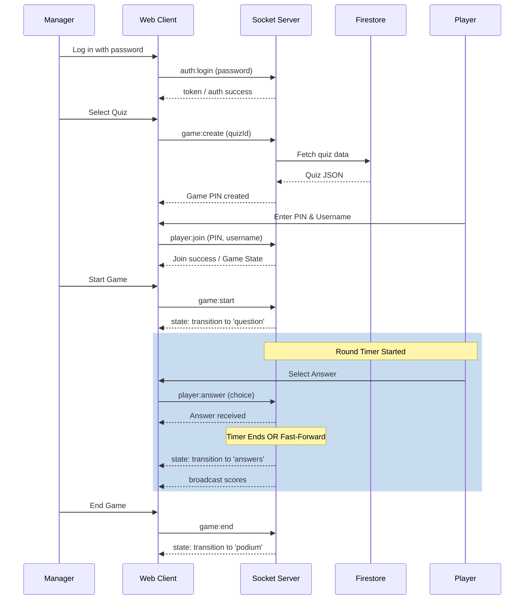

# Data Flow

## Overview

The **Data Flow** diagram maps the primary sequence of operations and data exchanges during a typical game lifecycle in OwlQuizyThingy.

## Interaction Flow (Sequence Diagram)

## State Management

The backend Node.js server maintains the absolute truth of the game state. Client instances only receive sanitized, partial views of this state (e.g., players do not see the correct answer until the round ends).

- **Payload Validation**: Every step in this data flow that crosses the client-to-server boundary is validated using Zod.
- **Round Concurrency**: Timers are bound to a specific generation token to prevent stale callbacks from triggering accidental state transitions.
